# Server Side Rendering with React Redux by Stephen Grider

## Why we need SSR and what problems it solves 
- To get some content on the screen we do this 
- 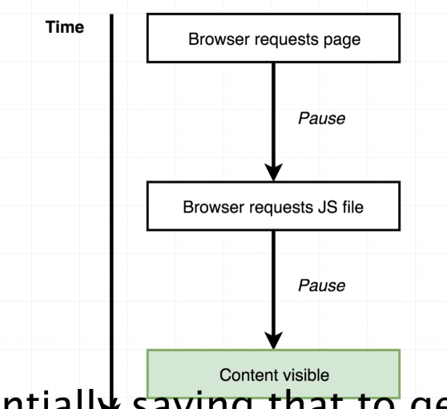
- 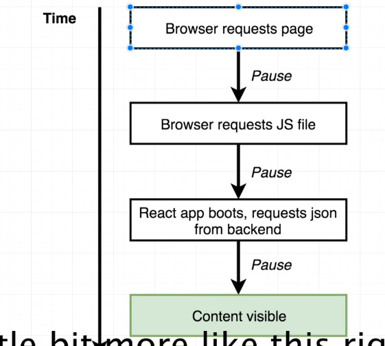
- Not the most efficient solution in the world to get useful information in front of the user.
- Loading a page as fast as possible improves the revenue of the company.
- So we need SSR to solve this.
- Goal of SSR is to make content visible on the user's screen as quickly as possible and we dont want to make so many round trips before any content appears in front of the user.
- We just want to make one request.
- SSR dramatically decreases the time it takes to load content for the user.
- When we create a traditional React App, the first HTML document that is sent by the server has very sparse content inside of it.
- But when we use SSR, the HTML document sent by the server has a lot of content inside of it.
- The initial request in case of SSR gets all the information we need to render information on the screen.
- 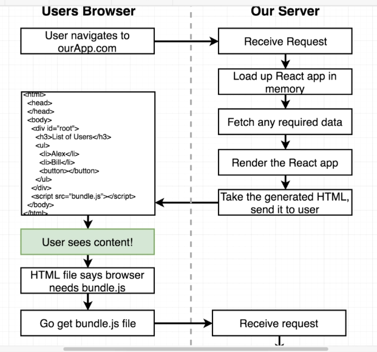
- 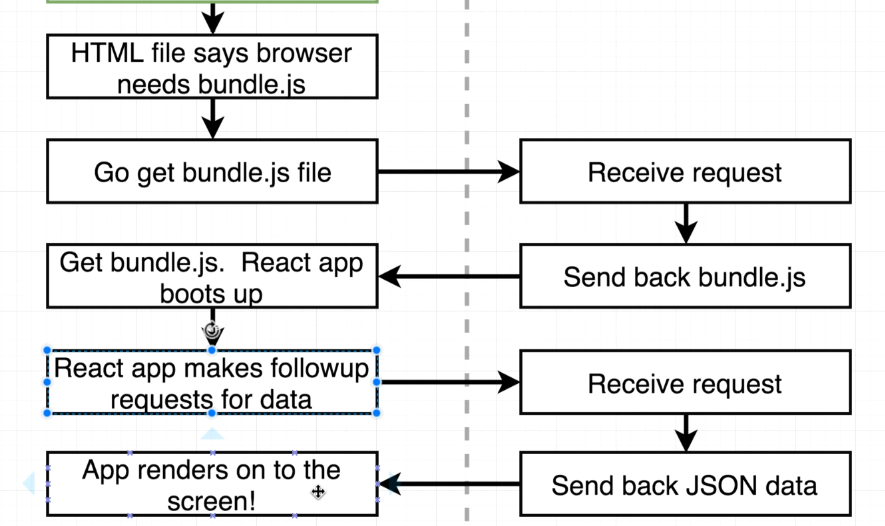

## Sample App to visualize server side rendering
- We will have 2 backend servers 
- 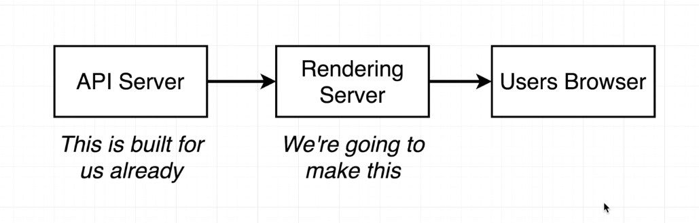
- API server handles all business logic, will give list of users, list of admins and handling authentication
- Rendering Server is responsible for rendering application and serving it to the user
- 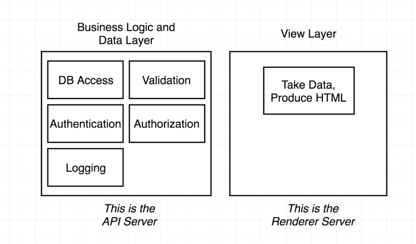
- All the API server really needs to do is to produce JSON
- Rendering Server takes the data as JSON and produces HTML
- Rendering Server has customized react logic that goes inside it.
- By splitting our application into these 2 tiers or server, we can easily scale our application also.
- 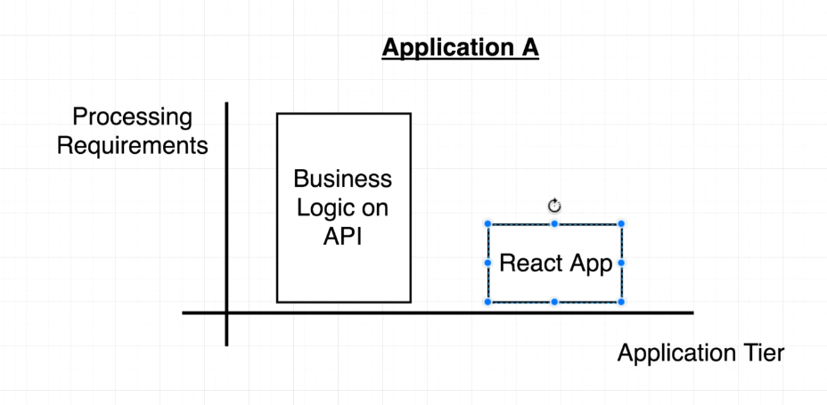
- 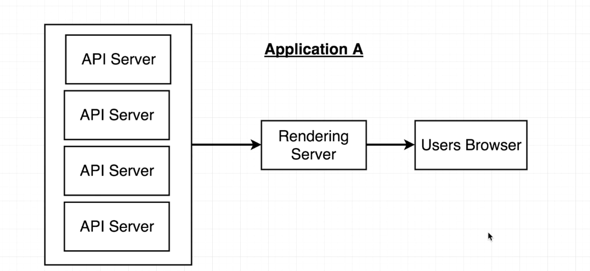
- 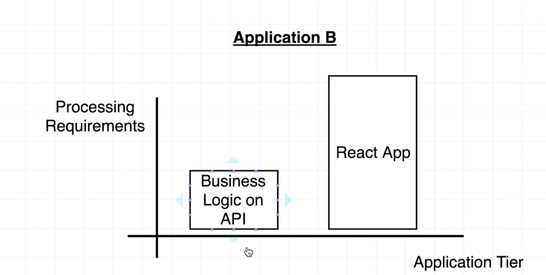
- 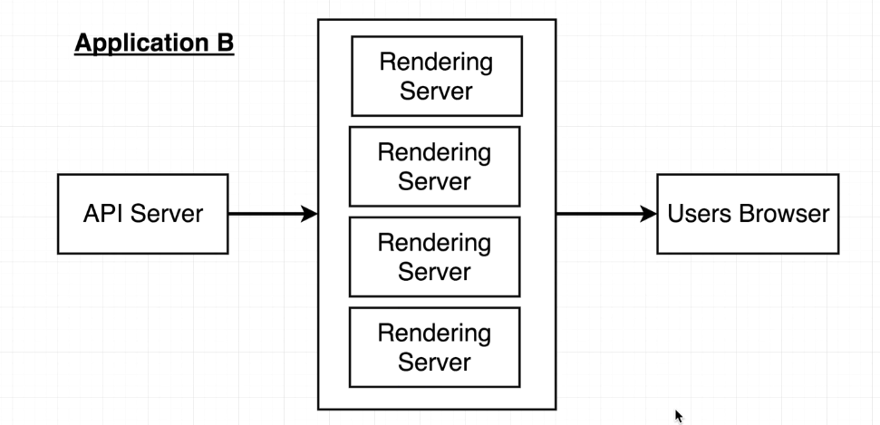
- Server side rendering is not perfect
- It is not the fastest thing in the world.
- By having a different rendering server, we can easily scale it up and allocate more resources to it to mitigate its poor performance. 
- React Server Side Rendering is computationally slow and time-consuming.
- Walmart Labs build electrode which is a react/node.js application platform that powers walmart.com and improves performance of its server side rendering.

## Building the application
- 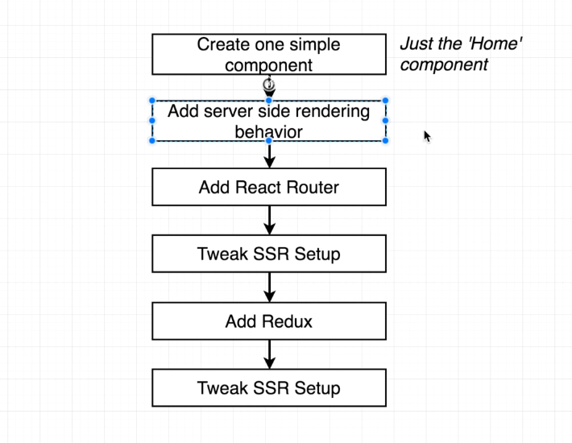
- 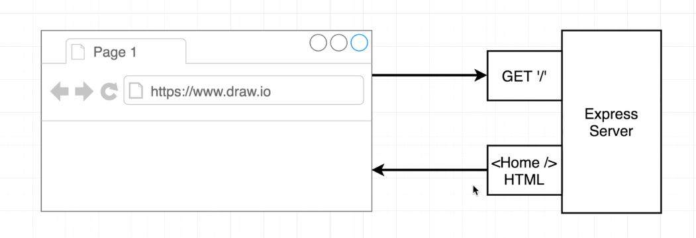
- Create an express server like this 
```js
const express = require('express');
const app = express();

app.get('/', (req, res) => {

})

app.listen(3000,()=>{
    console.log("Server running on port 3000");
});
```
- Create a simple Home component like this
```js
import React from 'react';
const Home = () => {
  return <div> I am the home component</div>
};
export default Home;
```
- Note that in index.js we are using CommonJS modules syntax whereas inside the Home component we are using ES6 Modules syntax.
- 
- To turn our Home HTML component to send it down to the user, we need to use React DOM library 
- It has 2 functions: render() and renderToString()
- We will ReactDOM.renderToString() function
- We can use our react component inside our node.js express application like this 
```js
const express = require('express');
const React = require('react');
const renderToString = require('react-dom/server').renderToString;
const Home = require('./client/components/home').default;
const app = express();

app.get('/', (req, res) => {
// We are using JSX inside node.js code.
    const content = renderToString(<Home/>);
    res.send(content);
})

app.listen(3000,()=>{
    console.log("Server running on port 3000");
});

```
- But this is not going to run. This is because node.js doesnot know how to run JSX code.
- If we execute this using node src/index.js inside our terminal it will display an error

## How does client side React Code work?
- All of our files with JSX are imported into a single index.js
- Babel compiles these files and converts it into normal javascript es6 code
- We end up with bundle.js file which contains the transpiled code 
- 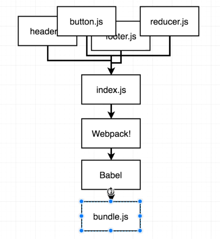
- We have to somehow think of integrating Webpack and Babel to convert all our JSX into normal es6 code.
- We should use webpack and babel to convert our code into es6 code into index.js and use node to run index.js file.
- We need to create webpack.config file and add a couple of options to it to inspect our index.js file and run Babel over it.

## Webpack and Babel 
- Webpack and Babel are essential tools in the development workflow for React applications. They help streamline and enhance the process of building, bundling, and transforming your code.
- Webpack is a powerful module bundler that packages your JavaScript and other assets (like CSS, images) into bundles that can be efficiently loaded by the browser. It transforms your source code into a format suitable for deployment.
- Has the following features:
- Bundling: Combines multiple JavaScript files into a single bundle or multiple chunks for efficient loading.
- Loaders: Transforms files into modules that can be included in your dependency graph. For example, you can use loaders to convert JSX (React's syntax) into plain JavaScript.
- Plugins: Extends Webpack's capabilities with additional functionalities like minification, HMR (Hot Module Replacement), and more.
- Code Splitting: Splits your code into smaller chunks to load parts of your application only when needed, improving performance.
- **Babel** is a JavaScript compiler that transforms modern JavaScript (ES6+) and JSX syntax into backwards-compatible JavaScript that can run in older browsers. It ensures that you can use the latest features of JavaScript without worrying about browser compatibility.
- Has the following features:
- Transpiling: Converts ES6+ syntax to ES5 syntax.
- Plugins and Presets: Modular transformations for various JavaScript features, such as transforming JSX, async/await, and more.
- Polyfills: Adds support for newer JavaScript features that aren't natively supported by older environments.
- In a React development environment, Webpack and Babel work in harmony to streamline the build process:
- Webpack handles bundling and asset management.
- Babel transforms your modern JavaScript and JSX code into browser-compatible JavaScript using Webpack loaders.
- Write your React components using JSX and modern JavaScript syntax.
- Webpack processes your files and uses Babel to transpile the code.
- Webpack bundles the transpiled code and assets into a format ready for deployment.
- By using Webpack and Babel, you can take full advantage of modern JavaScript features and build efficient, optimized React applications.
- In our code to process our jsx we will create webpack.server.js
```js
const path = require('path');

module.exports = {
    //  Inform webpack that we are building a bundle for node.js rather than for the browser.
    target: 'node',
    // Tell webpack the root file of our server application
    entry: './src/index.js',
    // Tell webpack where to put the output file that is generated
    output: {
        filename: 'bundle.js',
        path: path.resolve(__dirname, 'build'),
    },

    //Tell webpack to run babel on every file it runs through
    module: {
        rules: [
            {
                test: /\.js?$/,
                loader: 'babel-loader',
                exclude: /node_modules/,
                options: {
                    presets: [
                        'react',
                        'stage-0',
                        //env is a master preset and runs all transpiled rules for the last 2 versions of the browser
                        ['env',{targets:{browsers: ['last 2 versions']}}]
                    ],
                }
            }
        ]
    }
};
```
- To run this configuration using webpack we need to add some scripts in package.json
- so we will include the following code:
```js
"scripts": {
    "dev:build:server": "webpack --config webpack.server.js"
  },
```
- Once we run npm run dev:build:server, we can see a build folder being generated with bundle.js file inside of it.
- This file has all the code for express, react, react dom and in the very end it has our react code also but now represented in plain javascript. 
- Now this file can safely be executed by node.
- Run node build/bundle.js 
- It will fire up the express server and we see the following
- 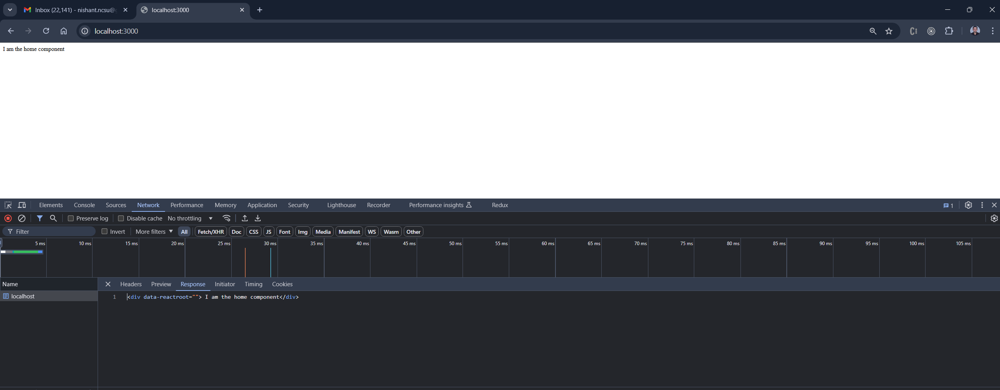
- 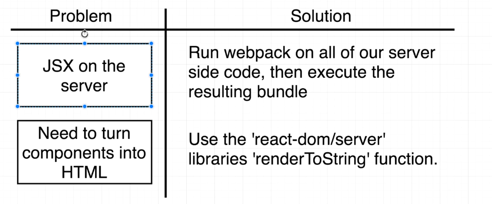
- With server side all the client side code and server side code gets compiled into a single application that contains both of our client and server logic.

## Server Configuration
- Currently, if we make changes to home component and save it and refresh our browser, nothing gets reflected.
- 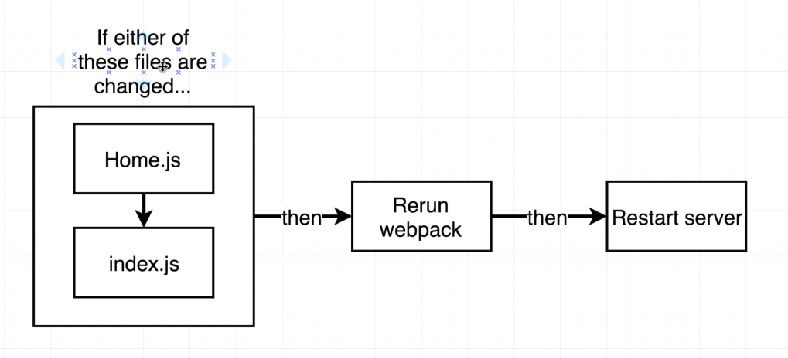
- We need to edit our package.json file.
- Webpack needs to watch all the files for changes and if it changes generate a new bundle.js
- nodemon just needs to look at changes in the build folder and execute it if a new bundle.js file is generated
```js
 "scripts": {
    "dev:server": "nodemon --watch build --exec node build/bundle.js",
        "dev:build:server": "webpack --config webpack.server.js --watch"
},
```
- Now if we open 2 terminals and run these scripts then any changes to the home component are automatically reflected
- Eventually we will combine both of these scripts to one single command.

## Server Side Rendering, Universal Javascript and Isomorphic Javascript
- 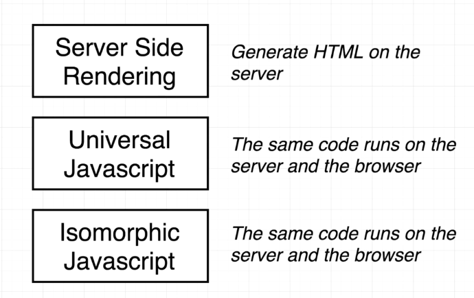
- We can do server side rendering even without react, also called server side templating.
- We should use the same coding styles both on client side and server side.
- Since we are using webpack and babel on our server side code, we can use ES2015 modules on server side.
- We can refactor our index.js code like this
```js
// const express = require('express');
// const React = require('react');
// const renderToString = require('react-dom/server').renderToString;
// const Home = require('./client/components/home').default;

import express from 'express';
import React  from "react";
import {renderToString} from 'react-dom/server';
import Home from './client/components/home';
```
## Client Side JS 
- 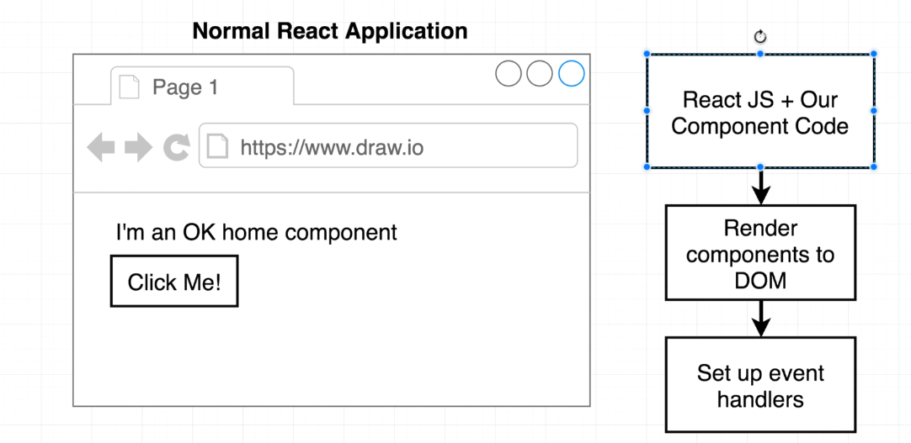
- In a regular react app, using babel and webpack we have compiled javascript code which is loaded into the browser.
- This code also attaches event handlers to various components of the DOM
- But in the current server side rendering setup, when we use renderToString() function of react, it just sends raw HTML from the component.
- Even if we define event handlers inside the component, they are not sent. 
- 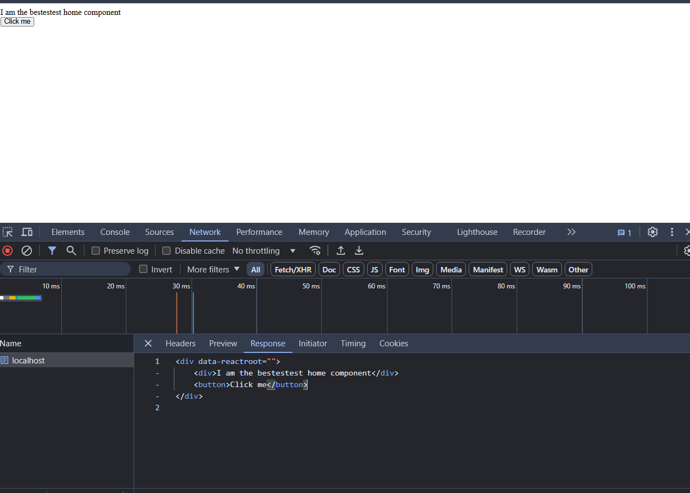
- We somehow need to ship all our javascript code along with html code. 
- Earlier we had the challenge to render our HTML code from react component to render from the server onto the browser.
- Our next challenge is to somehow send our javascript code along with HTML code from component at server side into the browser.
- To solve this we will create 2 bundles using webpack
- 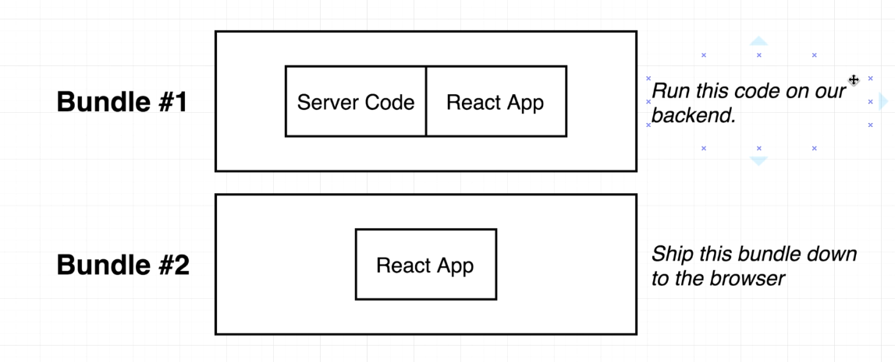
- We will setup a second webpack pipeline which will run alongside the first one.
- For this we will create webpack.client.js which will watch a file called client.js for changes
- Note that it will output all the transpiled code into a public folder.
- So now we have 2 bundles, one for the server side and other for the client side.
```js
const path = require('path');

module.exports = {
    // Tell webpack the root file of our server application
    entry: './src/client/client.js',
    // Tell webpack where to put the output file that is generated
    output: {
        filename: 'bundle.js',
        path: path.resolve(__dirname, 'public'),
    },

    //Tell webpack to run babel on every file it runs through
    module: {
        rules: [
            {
                test: /\.js?$/,
                loader: 'babel-loader',
                exclude: /node_modules/,
                options: {
                    presets: [
                        'react',
                        'stage-0',
                        //env is a master preset and runs all transpiled rules for the last 2 versions of the browser
                        ['env',{targets:{browsers: ['last 2 versions']}}]
                    ],
                }
            }
        ]
    }
};
```
- We want to make sure that once the browser has got all the server side, it comes back and fetches the client side code as well.
- For this we will need to make some changes to index.js file of express like this
```js
app.use(express.static('public'));
app.get('/', (req, res) => {
// We are using JSX inside node.js code.
    const content = renderToString(<Home/>);
    const html = `
<html>
<head></head>
<body>
    <div>${content}</div>
    <script src="bundle.js"></script>
</body>
</html>
`;
    res.send(html);
})
```
- So whenever we go to the root path of our application, we are serving up a html page that has our content from the Home component inside it.
- It also has a script tag with bundle.js. 
- It will automatically fetch this file from the public folder which is now accessible to all 
- So now we will see something like this 
- 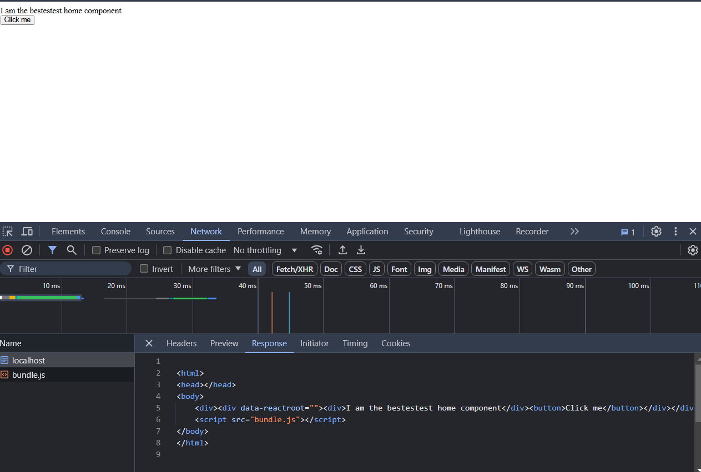

## Why we need a separate Client.js file ?
- 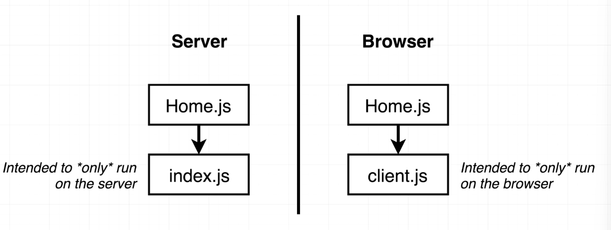
- We must do separation of concerns. The client code should never make call to some code that should only run on the server like an API key or any other sensitive information.
- Client.Js is the startup file for our application specifically in the browser. 
- Index.JS will have code that is exclusively for the server whereas client.JS will have code specifically for the browser.
- Having these 2 files allows us to run different configurations of react-router and redux
- 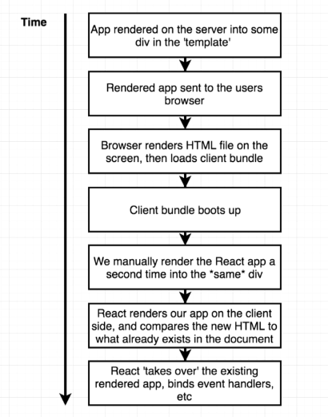
- First the server side rendered app is loaded, then client side bundle is run and React takes over and binds the event handlers.
- Client side bundles breathes life into the server-side rendered skeleton.
- This process of putting functionality back into the DOM that was already rendered or all the HTML is already rendered is called **hydration**.
- For this first in the index.js we need to make sure that our content is rendered into a div with id of root like this 
```js
app.use(express.static('public'));
app.get('/', (req, res) => {
// We are using JSX inside node.js code.
    const content = renderToString(<Home/>);
    const html = `
<html>
<head></head>
<body>
    <div id="root">${content}</div>
    <script src="bundle.js"></script>
</body>
</html>
`;
    res.send(html);
})
```
- Now we will make changes to Client.js file and make sure the Home component gets rendered inside this root div like this 
```js
// Startup point for the client side application
import React from "react";
import ReactDOM from "react-dom";
import Home from "./components/Home";


ReactDOM.render(<Home />, document.getElementById("root"));
```
- Post React 17, ReactDOM.render() will not work, we need to use ReactDOM.hydrate()
```js
ReactDOM.hydrate(<Home />, document.getElementById("root"));
```
- If we go to the browser and click on the button we get the desired result and javascript starts working.
- 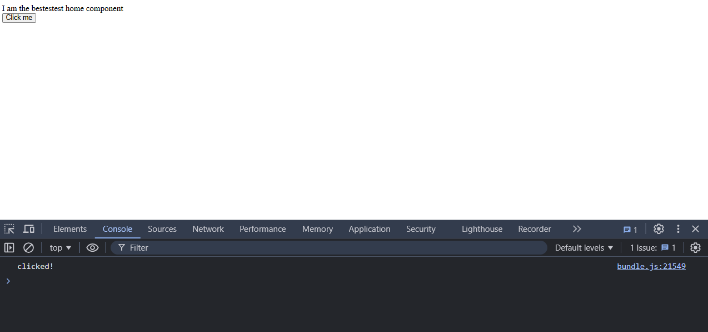

## Merging the Webpack config files
- We will use a npm package webpack-merge
- It takes both these 2 config files and produces a single config file
- It used object prototype inheritance used in javascript
- 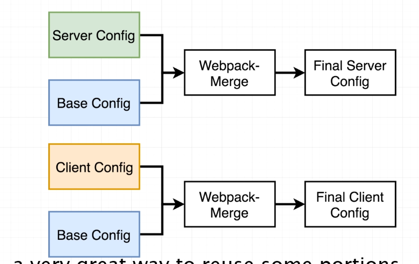
- We will create a webpack.base.js which will contain the common configuration of module from both client and server webpack config files.
- webpack.base.js will look like this:
```js
module.exports = {
    //Tell webpack to run babel on every file it runs through
    module: {
        rules: [
            {
                test: /\.js?$/,
                loader: 'babel-loader',
                exclude: /node_modules/,
                options: {
                    presets: [
                        'react',
                        'stage-0',
                        //env is a master preset and runs all transpiled rules for the last 2 versions of the browser
                        ['env',{targets:{browsers: ['last 2 versions']}}]
                    ],
                }
            }
        ]
    }
};
```
- webpack.server.js will look like this 
```js
const path = require('path');
const merge = require('webpack-merge');
const baseConfig = require('./webpack.base.js');

const config = {
    //  Inform webpack that we are building a bundle for node.js rather than for the browser.
    target: 'node',
    // Tell webpack the root file of our server application
    entry: './src/index.js',
    // Tell webpack where to put the output file that is generated
    output: {
        filename: 'bundle.js',
        path: path.resolve(__dirname, 'build'),
    }
};

module.exports = merge(baseConfig, config);
```
-webpack.client.js will look like this
```js
const path = require('path');
const merge = require('webpack-merge');
const baseConfig = require('./webpack.base.js');

var config = {
    // Tell webpack the root file of our server application
    entry: './src/client/client.js',
    // Tell webpack where to put the output file that is generated
    output: {
        filename: 'bundle.js',
        path: path.resolve(__dirname, 'public'),
    }
};

module.exports = merge(baseConfig, config);
```
- Currently in package.json we have 3 scripts that we need to run which is cumbersome
```js
"scripts": {
    "dev:server": "nodemon --watch build --exec node build/bundle.js",
    "dev:build:server": "webpack --config webpack.server.js --watch",
    "dev:build:client": "webpack --config webpack.client.js --watch"
  },
```
- To fix it we will use a npm package npm-run-all
- We can use it like this 
```js
"scripts": {
    "dev": "npm-run-all --parallel dev:*",
    "dev:server": "nodemon --watch build --exec node build/bundle.js",
    "dev:build-server": "webpack --config webpack.server.js --watch",
    "dev:build-client": "webpack --config webpack.client.js --watch"
  },
```
## Ignoring files with Webpack
- 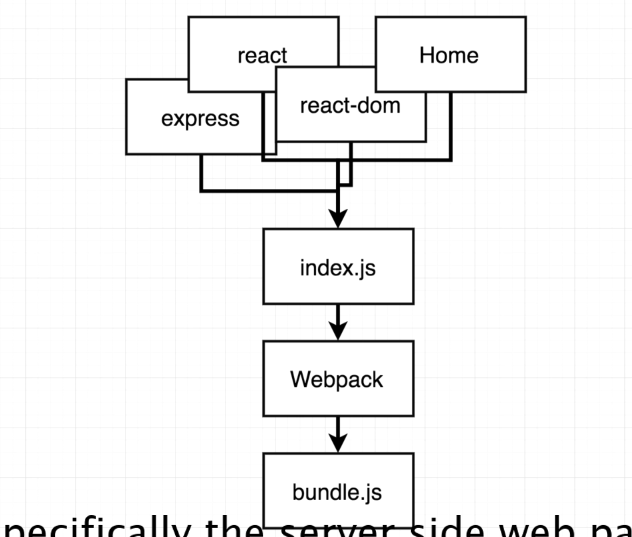
- We are not super concerned with size of the server bundle file
- Currently what happens is any library that is inside require() is automatically fetched and put inside the bundle.js file
- However, We do need a faster webpack process.
- We will make use of another npm package: webpack-node-externals
- We will use it like this 
```js
const path = require('path');
const merge = require('webpack-merge');
const baseConfig = require('./webpack.base.js');
const webpackNodeExternals = require('webpack-node-externals');


const config = {
    //  Inform webpack that we are building a bundle for node.js rather than for the browser.
    target: 'node',
    // Tell webpack the root file of our server application
    entry: './src/index.js',
    // Tell webpack where to put the output file that is generated
    output: {
        filename: 'bundle.js',
        path: path.resolve(__dirname, 'build'),
    },
    externals: [webpackNodeExternals()]
};

module.exports = merge(baseConfig, config);
```
- webpack-node-externals will tell webpack not to put any file inside the bundle.js that exists inside the node_modules folder.
- Earlier bundle.js file used to be 757kb now it is 4.68kb
- 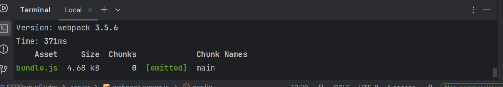
- We will create a separate helpers folder and create a renderer function that will contain the logic of encapsulating the html for the React App
- Then we can make our index.js file even smaller like this
```js
import express from 'express';
import renderer from "./helpers/renderer";

const app = express();

//Make the root directory public
app.use(express.static('public'));
app.get('/', (req, res) => {
// We are using JSX inside node.js code
res.send(renderer());
})

app.listen(3000,()=>{
    console.log("Server running on port 3000");
});
```
## Implementing React Router Support
- 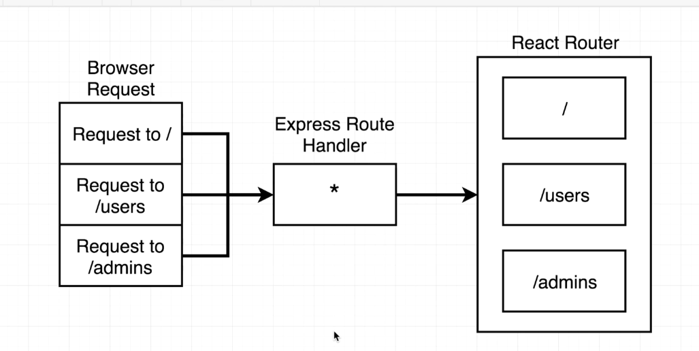
- We will have 2 tiers of routing in our application: one tier is for Express Router Handler and other is for React Router
- Express will not enforce any routing rules on the incoming requests.
- Express will pass the routing decision to react router.
- We can always add rules to express route handler. 

## BrowserRouter vs StaticRouter
- How React Router works in a normal vanilla React App with a Browser Router can be shown in the following diagram:
- 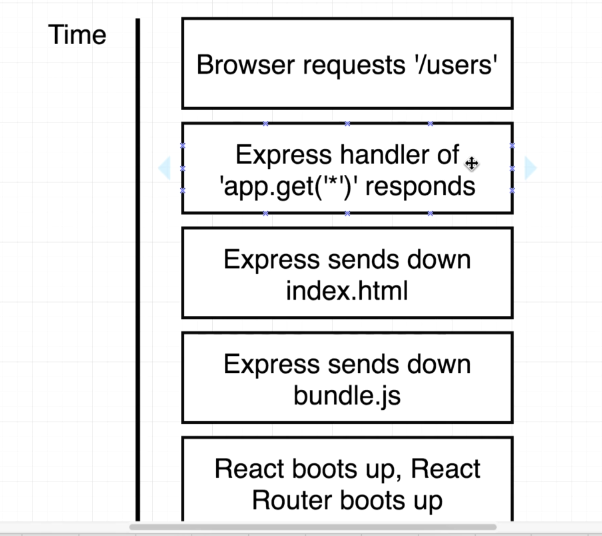
- 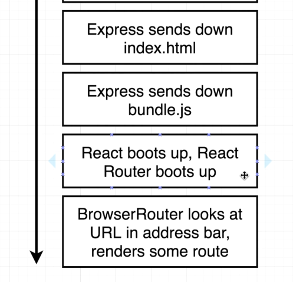
- BrowserRouter is harcoded to look at the address in the address bar.
- However on the server side, no address bar is present.
- To solve this problem, we need 2 different routers
- 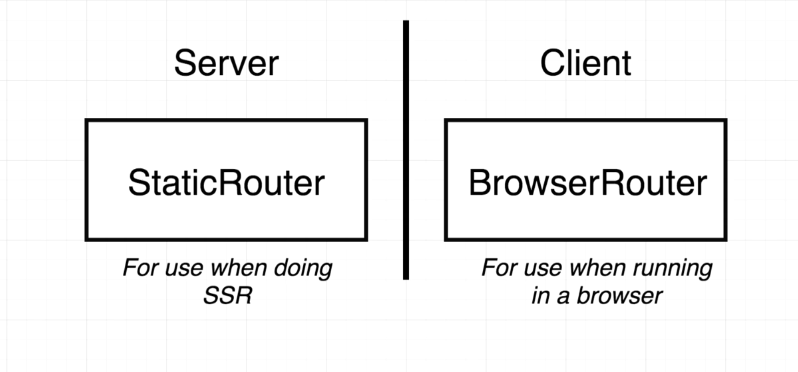
- StaticRouter is specifically made for use with SSR.
- **StaticRouter will run on the server and Browser Router will run on the browser.**
- To use both of these routers, we will do the following:
- 
- First, we will create a file Routes.js which will contain all different route mappings of our application, only route mappings only
- Then we will import that routes file inside in the renderer.js file for the server and client.js file for the client(browser).
- In renderer.js we will make use of StaticRouter and inside the client.js we will use BrowserRouter.
- Routes.js file will look like this 
```js
import React from 'react';
import {Route} from 'react-router-dom';
import Home from './components/Home';

export default ()=>{
    return (
        <div>
            <Route exact path="/" component={Home}/>
        </div>
    )
}
```
- Using this Route Mapping file inside client.js can be done like this:
- Note that in client.js we make use of the Browser Router.
```js
// Startup point for the client side application
import React from "react";
import ReactDOM from "react-dom";
// import Home from "./components/Home";
import {BrowserRouter} from "react-router-dom";
import Routes from "./Routes";


ReactDOM.hydrate(
    <BrowserRouter>
        <Routes />
    </BrowserRouter>
    , document.getElementById("root"));
```
- Sometimes we may see an error message like this
- 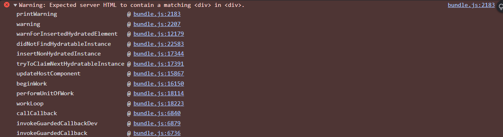
- This error message is because there is a mismatch in the html being rendered by the server and the html that is being hydrated from the client
- React expects both of them to have the same HTML output
- For the server side changes, we will pass the Routes.js file to the renderer.js file also
```js
import React from "react";
import {renderToString} from "react-dom/server";
import {StaticRouter} from "react-router-dom";
import Routes from "../client/Routes"
// import Home from "../client/components/Home";

export default (req) =>{
    const content = renderToString(
        <StaticRouter location={req.path} context={{}}>
            <Routes />
        </StaticRouter>
    );
    return `
<html lang="en">
<head>
<title>React App</title>
</head>
<body>
    <div id="root">${content}</div>
    <script src="bundle.js"></script>
</body>
</html>
`;
};
```
- Please note that Static router has a required props of context which is an empty object and a location which is set to the current path of the user's request.
- This req is passed from the request parameter in index.js to renderer.js 
```js
//Make the root directory public
app.use(express.static('public'));
app.get('/', (req, res) => {
// We are using JSX inside node.js code
    res.send(renderer(req));
})
```
- To configure Express to allow all incoming requests and pass them to the react router, we need to do this(use * instead of /):
```js
//Make the root directory public
app.use(express.static('public'));
app.get('*', (req, res) => {
// We are using JSX inside node.js code
    res.send(renderer(req));
})
```
- For the app we are building we will use this API
- https://react-ssr-api.herokuapp.com/
- 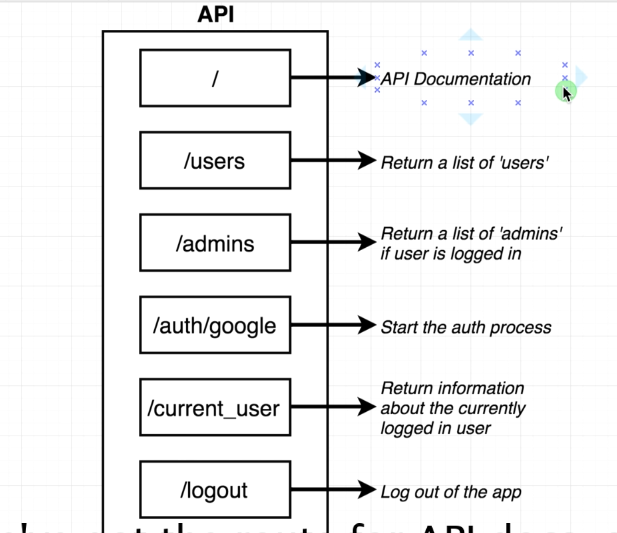
- Redux is incharge of all data management for our app
- However, Redux will work differently on server versus the client
- 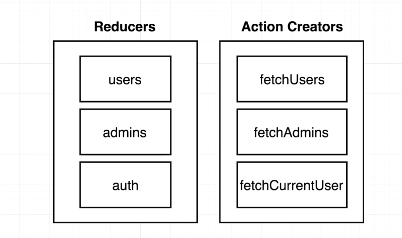
- 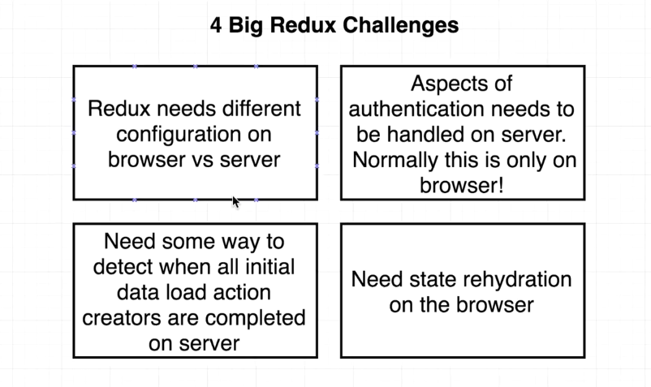
- On the client side, we have access to the cookie data used in cookie based authentication, but how do we get that cookie data on the server side. That's a significant challenge.

## Redux Refresher
- create Store: The createStore function in Redux is used to create a Redux store that holds the state of your application. The store's state can only be changed by dispatching actions.
```js
import { createStore } from 'redux';
import rootReducer from './reducers';

const store = createStore(rootReducer);

```
- In this example, rootReducer is a function that takes the current state and an action, and returns the new state.
- applyMiddleware: Middleware in Redux provides a third-party extension point between dispatching an action and the moment it reaches the reducer. applyMiddleware is used to apply middleware to the store.
```js
import { createStore, applyMiddleware } from 'redux';
import rootReducer from './reducers';
import logger from 'redux-logger'; // Example middleware

const store = createStore(rootReducer, applyMiddleware(logger));

```
- Here, logger is a middleware that logs actions and state changes to the console.
- thunk: Redux Thunk is middleware that allows you to write action creators that return a function instead of an action. 
- This is useful for handling asynchronous operations.
```js
import { createStore, applyMiddleware } from 'redux';
import thunk from 'redux-thunk';
import rootReducer from './reducers';

const store = createStore(rootReducer, applyMiddleware(thunk));

// An example of an action creator that returns a function
const fetchData = () => {
    return (dispatch) => {
        fetch('/api/data')
            .then(response => response.json())
            .then(data => dispatch({ type: 'FETCH_SUCCESS', payload: data }))
            .catch(error => dispatch({ type: 'FETCH_ERROR', error }));
    };
};

```
- In this example, fetchData is an action creator that performs an asynchronous fetch operation and dispatches different actions based on the result.

- Provider: The Provider component from react-redux makes the Redux store available to the rest of your app. By wrapping your app in the Provider, you can use the connect function to connect your components to the Redux store.
```js
import React from 'react';
import ReactDOM from 'react-dom';
import { Provider } from 'react-redux';
import App from './App';
import store from './store';

ReactDOM.render(
    <Provider store={store}>
        <App />
    </Provider>,
    document.getElementById('root')
);

```
## Redux Browser Store Creation
- We will first create a store for the client side in client.js like this 
```js
// Startup point for the client side application
import 'babel-polyfill';
import React from "react";
import ReactDOM from "react-dom";
// import Home from "./components/Home";
import {BrowserRouter} from "react-router-dom";
import {createStore,applyMiddleware} from "redux";
import thunk from "redux-thunk";
import {Provider} from "react-redux";
import Routes from "./Routes";
import reducers from "./reducers";

const store = createStore(reducers,{},applyMiddleware(thunk));
ReactDOM.hydrate(
    <Provider store={store}>
        <BrowserRouter>
            <Routes />
        </BrowserRouter>
    </Provider>
    , document.getElementById("root"));
```
- On the server side we will create a helper method to create a store on the server
```js
import {createStore,applyMiddleware} from 'redux';
import thunk from 'redux-thunk';
import reducers from '../client/reducers';

export default () =>{
    const store = createStore(reducers, {}, applyMiddleware(thunk));
    return store;
}
```
- Then we will import that store inside the index.js and pass it to the renderer function which will then have a provider to provide it to all components:
```js
import express from 'express';
import renderer from "./helpers/renderer";
import createStore from "./helpers/createStore";

const app = express();

//Make the root directory public
app.use(express.static('public'));
app.get('*', (req, res) => {
// We are using JSX inside node.js code
    const store = createStore();
    //Some logic to initialize and load data into the store.
    res.send(renderer(req,store));
})

app.listen(3000,()=>{
    console.log("Server running on port 3000");
});

```
- Then we will create an action creator called fetch users like this :
```js
import axios from "axios";

export const FETCH_USERS = 'fetch_users';
export const fetchUsers = () => async dispatch => {
    const res = await axios.get('https://react-ssr-api.herokuapp.com/users');
    dispatch({
        type: FETCH_USERS,
        payload: res
    });

};
```
- Now to use this action creator we will need to create a usersReducer like this:
```js
import {FETCH_USERS} from "../actions";

export default (state = [], action) => {
    switch(action.type) {
        case FETCH_USERS:
            return action.payload.data;
            default:
                return state;
    }
}
```
- Finally once we have the stores defined at both the client and server, and the action creator and reducer defined, we can use it inside a new component called UsersListComponent:
```js
import React, {Component} from 'react';
import {connect} from 'react-redux';
import {fetchUsers} from "../actions";

class UserList extends Component {
    componentDidMount() {
        this.props.fetchUsers();
    }

    renderUsers(){
        return this.props.users.map(user => {
            return <li key={user.id}>{user.name}</li>
        })
    }
    render() {
        return (
            <div>
                Here is a big list of users:
                <ul>{this.renderUsers()}</ul>
            </div>
        )
    }
}

function mapStateToProps(state) {
    return {
        users: state.users,
    };
}

export default connect(mapStateToProps,{fetchUsers})(UserList);
```
- Here we are making use of the connect function of react-redux
- The connect function in react-redux is a powerful utility that connects React components to the Redux store. 
- It provides a way to access state and dispatch actions from within your components, making it easier to manage state and keep your UI in sync with the data.
- How connect Works
  1. Mapping State to Props: The connect function allows you to specify how the Redux state should be transformed into props for your component. This is done using the mapStateToProps function.
  2. Mapping Dispatch to Props: You can also specify how action creators should be transformed into props using the mapDispatchToProps function.
  3. HOC (Higher-Order Component): connect returns a higher-order component (HOC) that wraps your component, providing it with the specified props.
```js
import React from 'react';
import { connect } from 'react-redux';
import { increment, decrement } from './actions';

const Counter = ({ count, increment, decrement }) => (
  <div>
    <p>{count}</p>
    <button onClick={increment}>Increment</button>
    <button onClick={decrement}>Decrement</button>
  </div>
);

const mapStateToProps = (state) => ({
  count: state.counter
});

const mapDispatchToProps = {
  increment,
  decrement
};

export default connect(mapStateToProps, mapDispatchToProps)(Counter);

```
- The connect function is a cornerstone of integrating Redux with React. It allows you to:
- Access specific pieces of Redux state as props in your components.
- Dispatch actions from within your components as props.
- Keep your components decoupled from the Redux store, promoting a clear separation of concerns.


### Please note uptil now, all the data from redux store is being fetched from the client side, not from the server side. We still have to do some work to fetch data from the server side
- 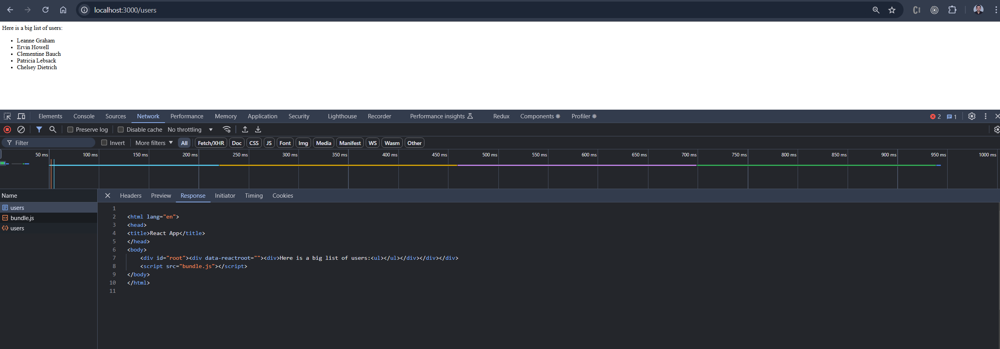

## Now we need to focus on the second problem: How we are going to detect when all initial data load action creators are completed on the server
- How data loading works on the browser
- 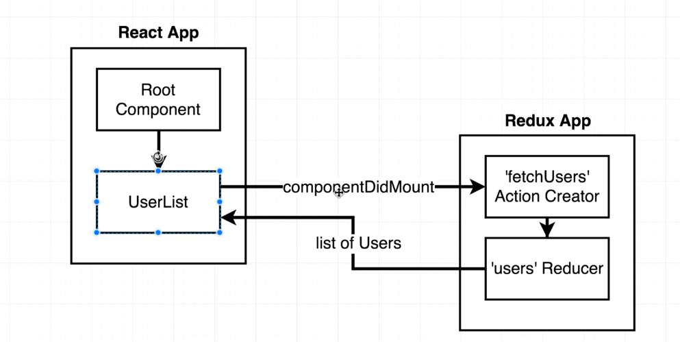
- 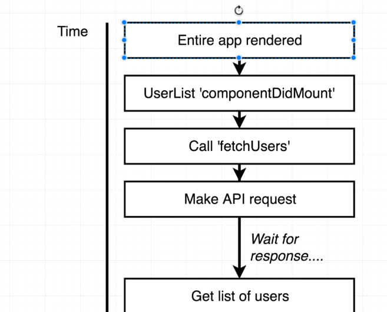
- 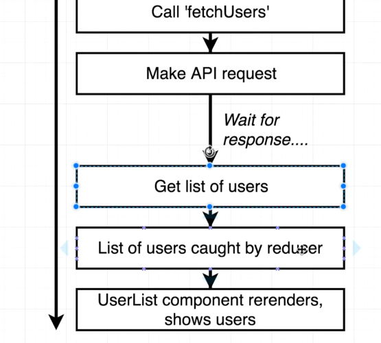
- On the server side inside renderer.js we render our application using renderToString() function and instantly send our response back to the browser
- There is no time to allow the app to fetch the users data from the API
```js
const content = renderToString(
        <Provider store={store}>
          <StaticRouter location={req.path} context={{}}>
            <Routes />
          </StaticRouter>
        </Provider>
);
return `
<html lang="en">
<head>
<title>React App</title>
</head>
<body>
    <div id="root">${content}</div>
    <script src="bundle.js"></script>
</body>
</html>
`;
```
- So our timeline on server side looks like this 
- 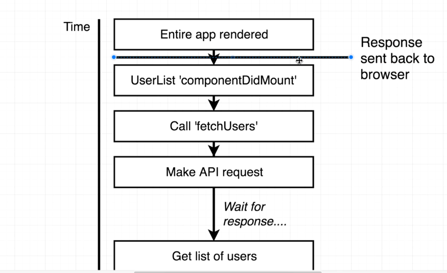
- With server side rendering component lifecycle methods like componentDidMount donot even work on the server.
- On the server, traditional data loading techniques donot work.
- One way to solve this problem would be to try to load the application 2 times: 
- 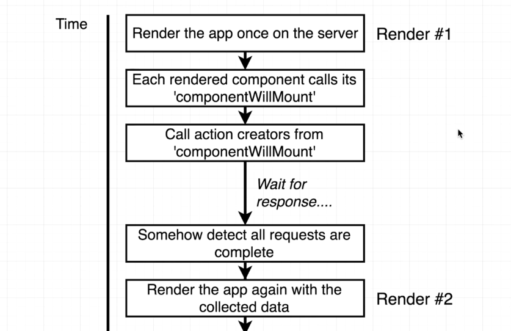
- 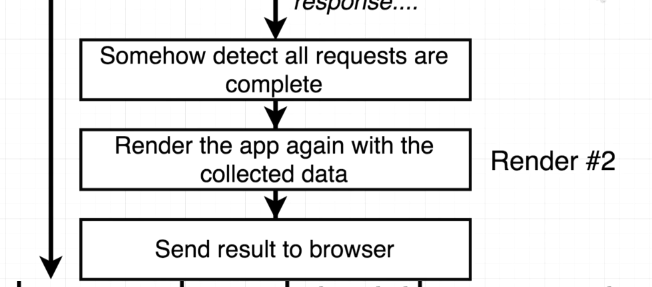
- 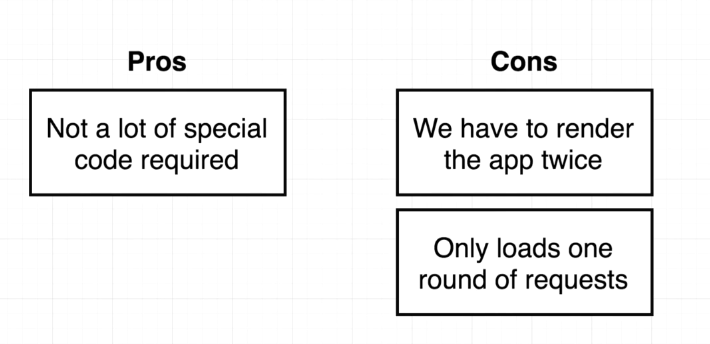
- 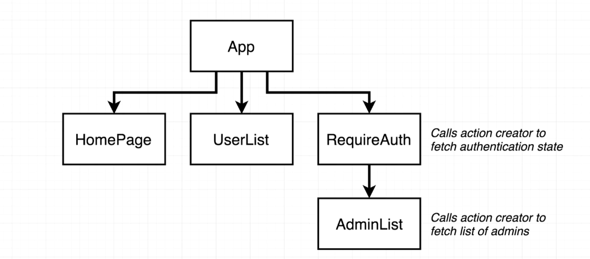
- This approach of loading the application 2 times doesn't work very well.

## Alternative solution for server side data loading
- 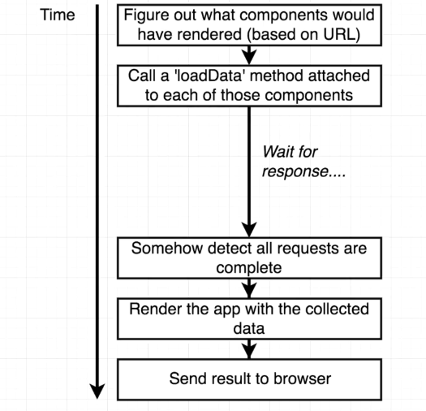
- Even Next.js uses the same approach for its server side rendering.
- We will attach a function to all of our components called loadData().
- This function will initiate the data loading process.
- Once this function is complete, we will render the app with collected data.
- 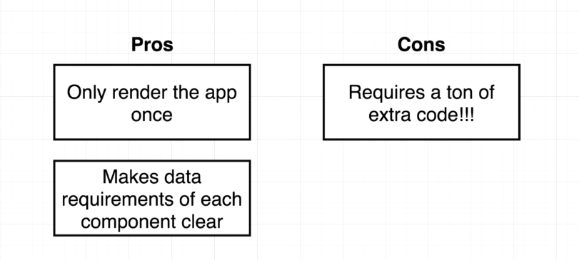

## Trying the above solution step by step

### Figure out what components would have rendered based on URL
- We will make use of a library called React Router Config 
- This library is a sub-package of the overall react router project, so it is an officially maintained solution
- This library is mostly used to help with server side rendering. 
- Good thing about this library is that it helps to figure out which set of components we want to show without rendering the application
- Bad thing is that in order to use it we have to mangle our route definitions
- We need to structure our routes in an array of objects like this:
- 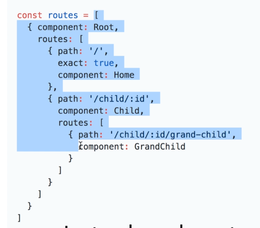
- We have to change our Routes.js to this:
```js
export default [
  {
    path: '/',
    component: Home,
    exact: true
  },
  {
    path: '/users',
    component: UserList
  }
];
```
- We also need to make changes in renderer.js 
- We will use the function renderRoutes() from react-router-config library
- Since now our routes is an array of object, this function takes an array of route objects and converts them to normal Routes that can be used by React Application
```js
import {renderRoutes} from "react-router-config";
import Routes from "../client/Routes"
import {Provider} from "react-redux";
// import Home from "../client/components/Home";

export default (req,store) =>{
    const content = renderToString(
        <Provider store={store}>
            <StaticRouter location={req.path} context={{}}>
                <div>{renderRoutes(Routes)}</div>
            </StaticRouter>
        </Provider>
    );
```
- We would have to make same changes in client.js as well.
```js
import {BrowserRouter} from "react-router-dom";
import {createStore,applyMiddleware} from "redux";
import thunk from "redux-thunk";
import {Provider} from "react-redux";
import RenderRoutes from "react-router-config/renderRoutes";
import Routes from "./Routes";
import reducers from "./reducers";
import {renderRoutes} from "react-router-config";

const store = createStore(reducers,{},applyMiddleware(thunk));
ReactDOM.hydrate(
    <Provider store={store}>
        <BrowserRouter>
            <div>{renderRoutes(Routes)}</div>
        </BrowserRouter>
    </Provider>
    , document.getElementById("root"));
```
- Now to figure what set of components will need to be rendered based on the requested URL, we will use matchRoutes function of react-router-config 
- Please note this will be done without the application being rendered as of now.
- We will make these changes inside the index.js file of the server, since there we will not only have our list of routes but also the incoming path 
```js
import 'babel-polyfill';
import express from 'express';
import renderer from "./helpers/renderer";
import createStore from "./helpers/createStore";
import Routes from "./client/Routes";
import {matchRoutes} from "react-router-config";

const app = express();

//Make the root directory public
app.use(express.static('public'));
app.get('*', (req, res) => {
// We are using JSX inside node.js code
// Some logic to initialize and load data into the store.
    const store = createStore();
    //return an array of components which will be rendered.
    matchRoutes(Routes,req.path);
    res.send(renderer(req,store));
})
```

### Now we can define some functions that will load data based on the list of components that need to be rendered.
- Goal is to load data into our application without actually having to render it.
- Please note we cannot use component lifecycle methods.
- We need to do the following steps:
- 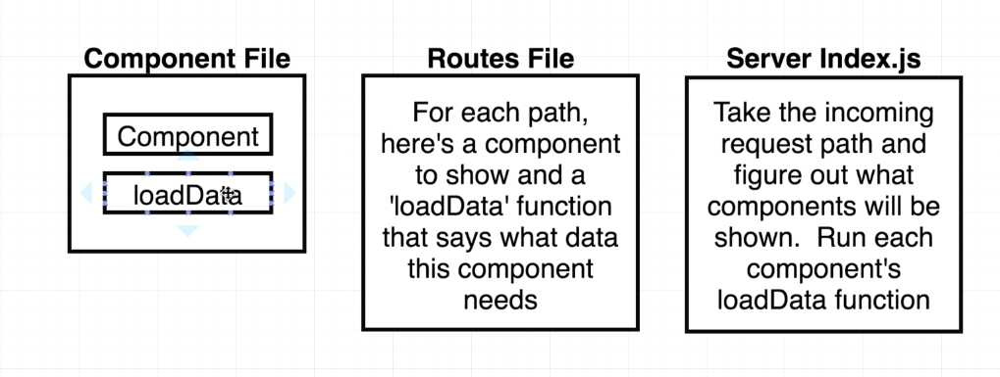
- First we will define a loadData function inside of our UserList component like this 
```js
function loadData(){
    console.log('Trying to load some data');

}

```
- Now we will include that load data function in Routes.js like this 
```js
export default [
  {
    path: '/',
    component: Home,
    exact: true
  },
  {
    loadData:loadData,
    path: '/users',
    component: UserList
  }
];
```
- Next we will call that function from our index.js file on the server
- We know that matchRoutes gives us a list of route objects which will now also have the loadData function
- We will map over it and call the loadData() if it exists 
```js
app.get('*', (req, res) => {
// We are using JSX inside node.js code
// Some logic to initialize and load data into the store.
  const store = createStore();
  //return an array of components which will be rendered.
  matchRoutes(Routes,req.path).map(({route})=>{
    return route.loadData ? route.loadData() : null;
  });
  res.send(renderer(req,store));
})
```

### Now we need to add data fetching requests inside our loadData function and wait for the response somehow
- 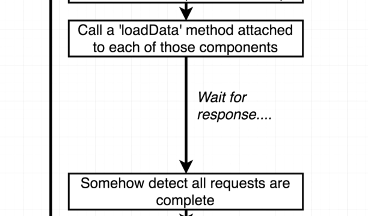
- 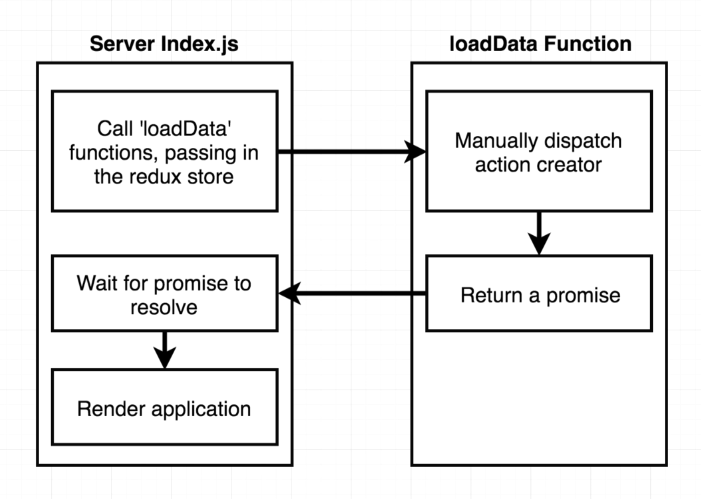
- We will pass the redux store to our component's load data function
- Inside the loadData() function inside of component, we will dispatch an action creator and return a promise back.
- In the index.js file for the server, for all the matched routes, we will wait for the promises to resolve before rendering the app
- This will somehow give us a signal as to when data loading is complete and we are ready to render our application 
- Changes to loadData function inside the component:
```js
//Returns a promise
function loadData(store){
  // console.log('Trying to load some data');
  return store.dispatch(fetchUsers());

}

```
- Changes to index.js file on server
````js
 //Returns an array of promises
const promises = matchRoutes(Routes,req.path).map(({route})=>{
  return route.loadData ? route.loadData(store) : null;
});

console.log(promises)
````
### Wait for data loading to complete
- Now we have an array of promises that will be returned 
- We can use Promise.All() which takes in an array of promises and returns a single new promise.
- As soon as the array of promises have resolved, that single promise will be resolved as well.
- 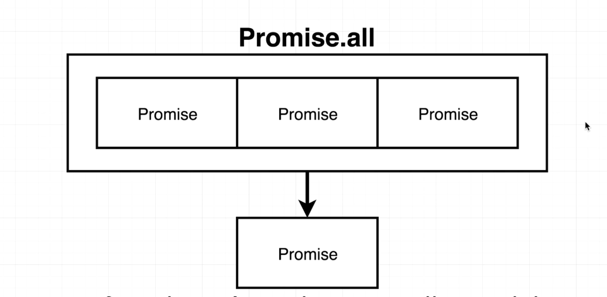
- We can change index.js file for the server like this 
```js
app.get('*', (req, res) => {
// We are using JSX inside node.js code
// Some logic to initialize and load data into the store.
  const store = createStore();
  //return an array of components which will be rendered.

  //Returns an array of promises
  const promises = matchRoutes(Routes,req.path).map(({route})=>{
    return route.loadData ? route.loadData(store) : null;
  });

  Promise.all(promises).then(() => {
    res.send(renderer(req,store));
  })
})
```
- If we go to the browser and check we can see that list of users is now being rendered from the server side
- 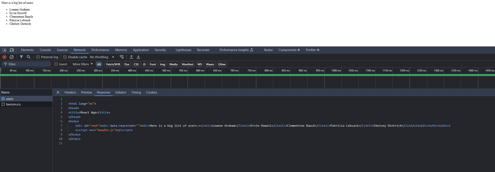


- Why did we not use the connect function for handling the action creator?
- The connect function works in a normal application by communicating with the Provider tag which is at the top level of the app
- Provider tag contains a reference to the Redux store, so when we call the mapStatetoProps function or mapDispatchToProps function, we are working with the Provider tag.
- Remember we want to render our application only one time, so no connect tag for us, no props or anything like that with loadData because we have not yet rendered our application.
- So we cannot use connect tag 
-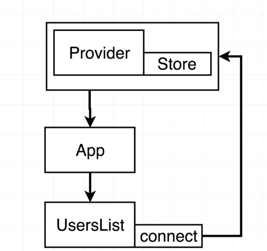

- Why are we using store.dispatch()?
- How does redux action creator work?
- When we call an action creator, it dispatches an action, through various middlewares and finally it reaches a reducer.
- 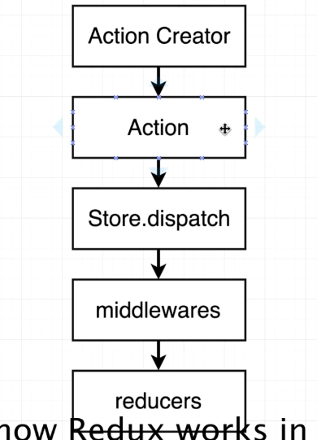
- Since we cannot use connect tag, we are working with Redux manually by calling the action creator ourselves to produce an action and then using the dispatch function to pipe that action through various middlewares and eventually onto the reducers.
- All data is loaded and is eventually sent to the reducer where we assemble our state object 
- 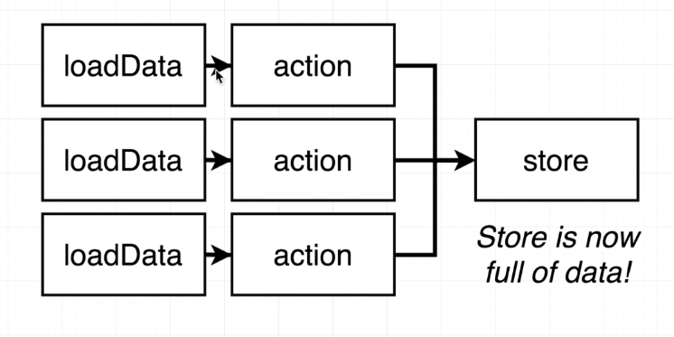
- 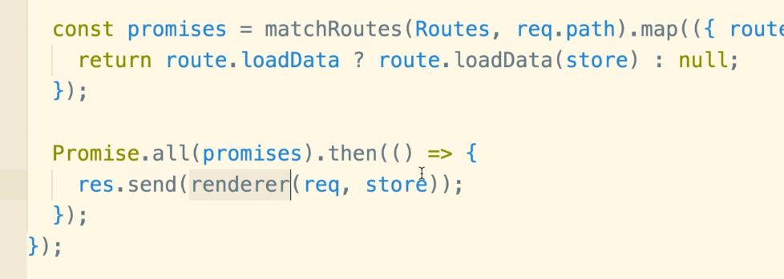
- When we call res.send(renderer(req,store)), our store is full of data. 
- It then works like a normal react-redux app. 
- During the render phase, all of our mapStatetoProps() functions will run and pull data out of the store and map it to props inside the component and component UI is rendered.
- Only difference now is that in server side rendering, we are doing action creator and dispatch manually